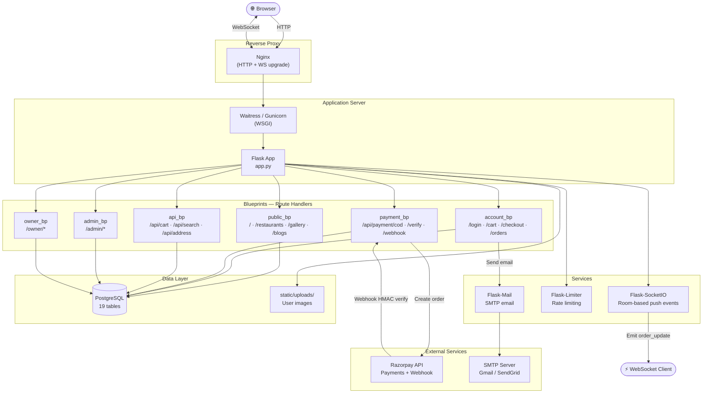
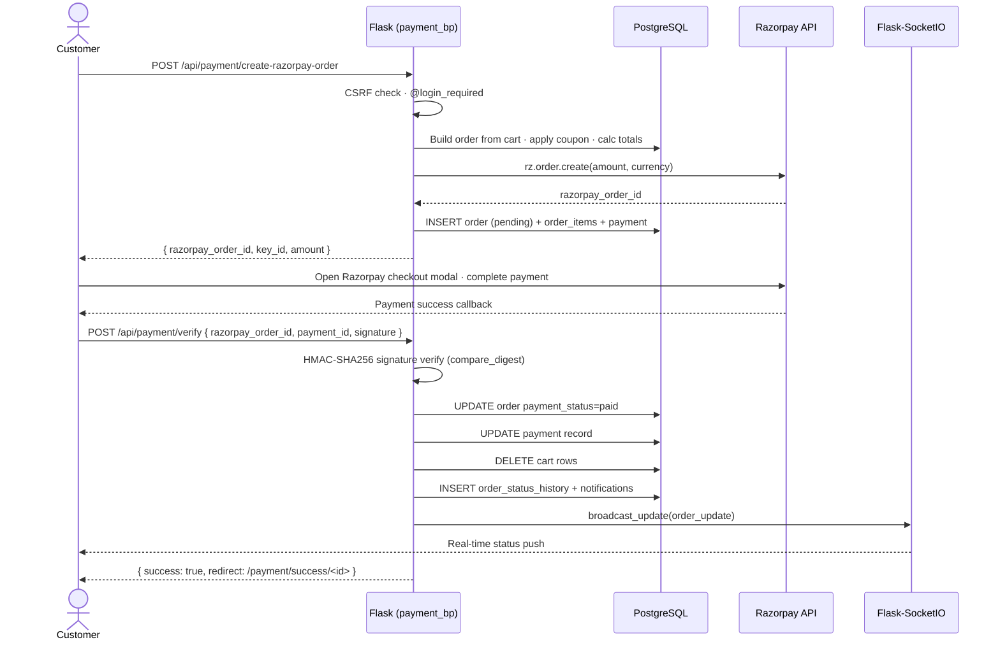
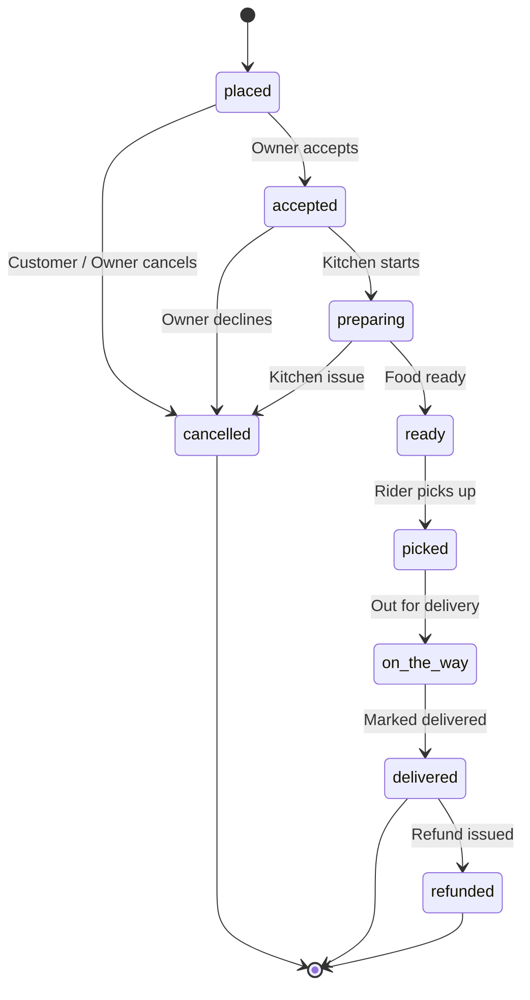
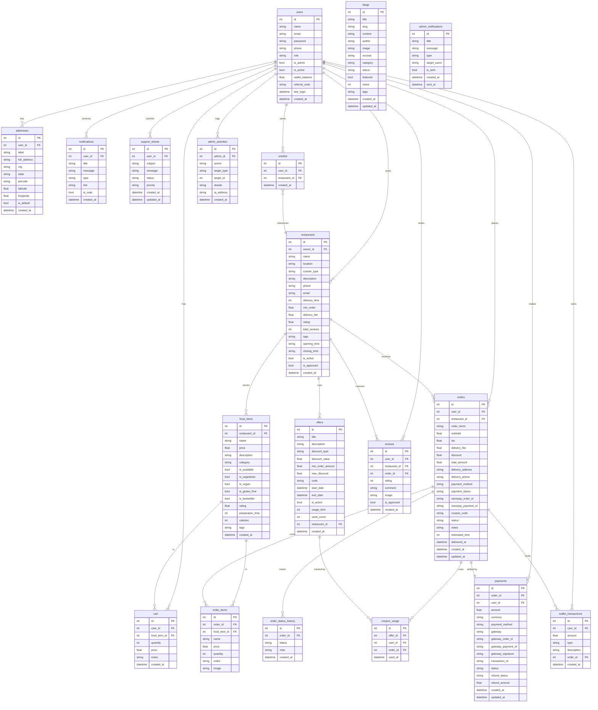

<p align="center">
  
</p>
<p align="center">
  <strong>Grabbite is full-stack, production-grade food delivery platform built with Python &amp; Flask.</strong><br/>
  Restaurant discovery · Cart &amp; checkout · Real-time order tracking · Razorpay payments · Role-based admin &amp; owner dashboards.
</p>

<p align="center">
  <a href="https://github.com/manav-2812/Grabbite/actions/workflows/ci.yml"></a>
  <a href="https://grabbite.up.railway.app"></a>
  
  
  
  
  
  
  
</p>

<p align="center">
  <a href="https://github.com/manav-2812/Grabbite/stargazers"></a>
  <a href="https://github.com/manav-2812/Grabbite/network/members"></a>
  <a href="https://github.com/manav-2812/Grabbite/issues"></a>
  <a href="https://github.com/manav-2812/Grabbite/commits/main"></a>
</p>

---

## Table of Contents

- [Overview](#overview)
- [Live Demo](#live-demo)
- [Key Features](#key-features)
- [Tech Stack](#tech-stack)
- [UI Showcase](#ui-showcase)
- [Architecture](#architecture)
- [Order Lifecycle](#order-lifecycle)
- [Database Schema](#database-schema)
- [Project Structure](#project-structure)
- [Getting Started](#getting-started)
- [Configuration](#configuration)
- [API Reference](#api-reference)
- [User Roles & Access Control](#user-roles--access-control)
- [Security](#security)
- [Testing](#testing)
- [Performance & Metrics](#performance--metrics)
- [Deployment](#deployment)
- [Contributing](#contributing)
- [Changelog](#changelog)
- [License](#license)
- [Author](#author)

---

## Overview

**GrabBite** is a full-stack food delivery web application engineered with **Python (Flask)** and **PostgreSQL**. It replicates the end-to-end experience of a modern food-tech product: customers discover restaurants, build orders, and pay through an integrated Razorpay checkout, while restaurant owners manage their menus and fulfil orders from a dedicated dashboard, and platform administrators maintain operational control through a real-time admin panel.

The codebase is written with production concerns in mind — CSRF protection, HMAC-verified payment webhooks, rate limiting, signed password-reset tokens, WebSocket-based live order tracking, and a role-based access control system spanning three distinct user types.

| Metric | Value |
|---|---|
| Database tables | **19** (relational, indexed, with audit trails) |
| API endpoints | **126** (57 JSON APIs / webhooks + 26 admin routes + 43 web views) |
| User roles | **3** — Customer, Restaurant Owner, Admin |
| Payment flows | **2** — Cash on Delivery + Razorpay (UPI / card / net banking) |
| Order lifecycle states | **9** — `placed → accepted → preparing → ready → picked → on_the_way → delivered / cancelled / refunded` |
| Real-time events | WebSocket push via Flask-SocketIO (order updates, admin alerts) |
| CI | GitHub Actions — Python 3.11 & 3.12, SQLite in-memory, **87 tests** |
| Primary database | PostgreSQL (SQLite fallback for local dev without `DATABASE_URL`) |

---

## Live Demo

> Deployed on **Railway** → <https://grabbite.up.railway.app>

Three demo accounts are seeded automatically on first boot. Use them to explore every role without registering:

| Role | Email | Password |
|---|---|---|
| 👤 Customer | `demo_user@gmail.com` | `Demo@1234` |
| 🍽️ Restaurant Owner | `owner@gmail.com` | `Owner@1234` |
| 🛡️ Admin | `admin@gmail.com` | `Admin@1234` |

> The live demo runs on a shared database — please do not change these passwords.

---

## Key Features

### For Customers

| Feature | Description |
|---|---|
| Restaurant discovery | Browse with ratings, cuisine types, location, and estimated delivery time |
| Dish gallery | Explore categorised dishes with details, calories, and prep time |
| Cart | Add, update, and remove items; cart is persisted in the DB and restored on login |
| Wishlist | Save favourite restaurants for later |
| Delivery addresses | Manage multiple saved addresses; select at checkout |
| Order placement | COD or online payment via Razorpay (UPI, card, net banking) |
| Order tracking | Live status updates pushed via WebSocket |
| Coupons | Apply discount codes at checkout with per-user usage limits |
| Reviews | Rate and review restaurants after delivery |
| Notifications | Real-time in-app notification feed |
| Blog | Read food-related articles |
| Search | AJAX search across restaurants, dishes, and blog posts |
| Password reset | Time-limited, signed email link via `itsdangerous` |
| Dark Mode | Full theme support with automatic preference persistence and high-contrast, premium styling |

### For Restaurant Owners

| Feature | Description |
|---|---|
| Owner dashboard | Revenue summary, pending orders, today's order count |
| Dish management | Add, edit, delete dishes with images and availability toggles |
| Order management | Accept incoming orders and update status through the delivery lifecycle |
| Restaurant profile | Edit name, description, timings, cuisine type, and cover image |

### For Admins

| Feature | Description |
|---|---|
| Live dashboard | Real-time stats — total orders, revenue, active restaurants, user count |
| User management | View, activate, deactivate, or delete accounts |
| Restaurant management | Approve new restaurant registrations; assign owners |
| Order oversight | View and manage all orders across all restaurants |
| Dish management | Manage menu items across all restaurants |
| Blog management | Create, edit, and publish blog articles |
| Offers & coupons | Create and manage discount codes with usage limits |
| Payment records | View all payment transactions and statuses |
| Review moderation | Approve or remove customer reviews |
| Support tickets | Read and respond to customer support submissions |
| Database viewer | Inspect raw table data directly from the admin panel |
| Activity log | Full audit trail of admin actions with timestamps |
| Data exports | Export orders, users, and revenue data |

---

## Tech Stack

### Backend

| Package | Version | Purpose |
|---|---|---|
| Python | 3.11+ | Language |
| Flask | 2.3.3 | Web framework |
| Flask-SQLAlchemy | 3.0.5 | ORM |
| Flask-Login | 0.6.3 | Session & authentication |
| Flask-SocketIO | 5.3.6 | WebSocket real-time events |
| Flask-Limiter | 3.5.0 | Rate limiting on sensitive routes |
| Flask-Mail | 0.10.0 | Transactional email |
| Flask-Migrate | 4.0.5 | Alembic-backed schema migrations |
| Flask-WTF | 1.2.1 | Form handling (admin blog forms) |
| Werkzeug | 2.3.8 | Password hashing, secure uploads (patched CVE-2023-46136) |
| psycopg2-binary | 2.9.9 | PostgreSQL driver |
| Pillow | 10.3.0 | Image resizing for uploads |
| itsdangerous | 2.2.0 | Signed password-reset tokens |
| razorpay | 1.4.1 | Payment gateway SDK |
| python-dotenv | 1.0.0 | `.env` loading |

### Frontend

| Technology | Purpose |
|---|---|
| HTML5 + Jinja2 | Server-side templating |
| Bootstrap 5 | Responsive layout and components |
| Custom CSS | `theme.css` (design tokens), `dark-mode-fixes.css` (global overrides), `modern.css`, `style.css`, `search.css`, `offers.css` |
| Vanilla JS (ES6) | Cart, search, order management, admin utilities |
| Socket.IO (client) | Live order status subscription |
| Razorpay Checkout.js | Payment modal |
| Font Awesome 6 | Icons |
| Google Fonts (Poppins + Inter) | Typography |

### Infrastructure & DevOps

| Component | Role |
|---|---|
| PostgreSQL | Primary database (production) |
| SQLite | Local dev fallback (no `DATABASE_URL` needed) |
| Waitress | Pure-Python WSGI production server (zero C deps, works on Windows + Linux) |
| Gunicorn | WSGI server for buildpack deploys (Railway / Heroku / Render) |
| Docker + docker-compose | Containerised deployment (app + PostgreSQL) |
| GitHub Actions | CI — runs 87 tests on Python 3.11 + 3.12 |
| Railway | One-click cloud deployment |
| Nginx | Reverse proxy, static files, WebSocket upgrade (VPS) |

---

## UI Showcase

| | |
|---|---|
|  |  |
|  |  |
|  |  |
|  | |

<p align="center">
  
</p>

---

## Architecture

### System Overview



### Razorpay Payment Flow



---

## Order Lifecycle



---

## Database Schema

GrabBite persists **19 relational tables**. The full entity-relationship diagram below reflects the actual models in [`models/`](models).



> Foreign keys use integer primary keys with PostgreSQL sequences. High-traffic lookups carry explicit indexes (`payments.order_id + status`, `cart.user_id + food_item_id`, and single-column indexes on all FK and status columns).

---

## Project Structure

```
Grabbite/
│
├── app.py                    # App factory — config, blueprints, CSRF, security headers
├── run.py                    # Entry point — Flask dev server or Waitress (prod)
├── db.py                     # SQLAlchemy db instance (singleton, avoids circular imports)
├── auth_routes.py            # Login, signup, logout, profile update handler functions
│
├── models/
│   ├── __init__.py           # Re-exports all models — no import changes elsewhere
│   ├── constants.py          # Shared enums: ROLES, ORDER_STATUSES, PAYMENT_*
│   ├── user.py               # User, Address
│   ├── restaurant.py         # Restaurant, FoodItem
│   ├── order.py              # Cart, Order, OrderItem, OrderStatusHistory
│   ├── payment.py            # Payment, WalletTransaction
│   ├── offer.py              # Offer, CouponUsage
│   ├── blog.py               # Blog
│   ├── review.py             # Review
│   ├── notification.py       # Notification, AdminNotification
│   ├── support.py            # SupportTicket
│   ├── wishlist.py           # Wishlist
│   └── admin.py              # AdminActivity
│
├── blueprints/
│   ├── __init__.py           # Imports and exposes all blueprint objects
│   ├── public.py             # Home, restaurants, gallery, blogs, search, offers
│   ├── account.py            # Auth pages, profile, cart, checkout, orders, addresses
│   ├── payment.py            # COD order, Razorpay order creation, verify, webhook
│   ├── admin/
│   │   ├── __init__.py       # Blueprint object + shared helpers (save_image, log_activity)
│   │   ├── dashboard.py      # Live stats, charts, recent activity
│   │   ├── users.py          # User management CRUD
│   │   ├── restaurants.py    # Restaurant CRUD, menu management, owner assignment
│   │   ├── orders.py         # All-orders view, status updates
│   │   ├── dishes.py         # Cross-restaurant dish management
│   │   ├── blogs.py          # Blog CRUD
│   │   ├── offers.py         # Coupon creation and management
│   │   ├── payments.py       # Payment records and refund tracking
│   │   ├── reviews.py        # Review moderation
│   │   ├── support.py        # Support ticket management
│   │   ├── notifications.py  # Admin broadcast notifications
│   │   ├── database.py       # Raw database viewer
│   │   └── exports.py        # CSV/JSON data exports
│   ├── api/
│   │   ├── __init__.py       # Blueprint object; imports all sub-modules
│   │   ├── cart.py           # GET/POST cart, add, update, remove, clear
│   │   ├── search.py         # Full-text search across restaurants, dishes, blogs
│   │   ├── address.py        # Delivery address CRUD
│   │   ├── coupon.py         # Coupon validation and application
│   │   ├── wishlist.py       # Wishlist add / remove
│   │   ├── reviews.py        # Review submission
│   │   ├── notifications.py  # Mark read, clear all
│   │   └── misc.py           # Health, misc helpers
│   └── owner/
│       ├── __init__.py
│       └── routes.py         # Dashboard, dishes CRUD, order status, profile
│
├── utils/
│   ├── helpers.py            # food_image_url, format_currency, safe_next_url, register_template_globals
│   ├── mail.py               # send_order_confirmation, send_password_reset_email, send_welcome_email
│   ├── decorators.py         # @admin_required, @owner_required, @role_required
│   ├── order_helpers.py      # _build_order_from_cart, _create_order_record, _post_order_notifications
│   ├── razorpay_helpers.py   # _get_razorpay_client, verify_razorpay_signature, verify_webhook_signature
│   ├── socket_events.py      # register_socket_events, broadcast_update
│   ├── uploads.py            # allowed_file, magic-byte check, resize_image, save_upload
│   ├── seed_data.py          # Seed restaurants, dishes, blog posts, and demo accounts on first boot
│   ├── image_data.py         # Curated Pexels image URL map for seeded data
│   └── page_builders.py      # Static offer cards and dish catalogue for gallery/search
│
├── templates/
│   ├── base.html             # Master layout (navbar, cart drawer, footer, socket init)
│   ├── index.html            # Homepage — hero, categories, top restaurants, trending dishes
│   ├── login.html / signup.html / signup_owner.html
│   ├── forgot_password.html / reset_password.html
│   ├── restaurants.html      # Restaurant listing with filters and pagination
│   ├── restaurant_menu.html  # Menu, reviews, wishlist button
│   ├── gallery.html          # Full dish catalogue grouped by category
│   ├── dish_detail.html      # Individual dish detail page
│   ├── cart.html             # Shopping cart with quantity controls
│   ├── checkout.html         # Address selection, payment method, order summary
│   ├── orders.html           # Customer order history
│   ├── profile.html          # Profile editor, password change
│   ├── address.html          # Saved delivery addresses
│   ├── wishlist.html         # Saved restaurants
│   ├── notifications.html    # In-app notification feed
│   ├── blogs.html / blog_detail.html
│   ├── search.html           # Live search results
│   ├── payment_success.html / payment_failed.html
│   ├── offer_details.html / about.html / help.html / careers.html
│   ├── database_viewer.html  # Admin raw table viewer
│   ├── admin/                # Admin panel templates
│   ├── owner/                # Owner dashboard templates
│   ├── emails/               # Transactional HTML email templates
│   └── errors/              # 403, 404, 500 error pages
│
├── static/
│   ├── css/                  # modern.css, style.css, search.css, offers.css, theme.css, dark-mode-fixes.css
│   ├── js/                   # admin-utils.js, location-manager.js, menu-manager.js, modern.js
│   ├── img/                  # Logo, default images, avatars
│   └── uploads/              # User-uploaded images (gitignored)
│
├── scripts/
│   ├── audit_and_fix.py      # DB health check: tables, sequences, FK integrity, order smoke test
│   └── fix_sequences.py      # Resets PostgreSQL sequences to MAX(id) after a bulk import
│
├── tests/
│   ├── test_smoke.py         # Smoke tests — app boot, routing, auth redirects, JSON APIs
│   ├── test_order_logic.py   # Unit tests — Order/OrderItem models, pricing, coupon, _create_order_record
│   └── test_payment_logic.py # Unit tests — Payment model, HMAC signatures, webhook DB side-effects
│
├── docs/
│   ├── API.md                # Full API reference (endpoints, request/response envelopes)
│   └── DEPLOYMENT.md         # Full production deployment guide (VPS, Docker, Railway, cloud)
│
├── migrations/               # Alembic migrations (env.py + versions/)
├── .github/workflows/ci.yml  # GitHub Actions CI pipeline
│
├── Dockerfile                # Multi-stage production image (python:3.11-slim)
├── docker-compose.yml        # App + PostgreSQL for local Docker development
├── .dockerignore             # Excludes .venv, .env, instance/, tests/ from the image
├── Procfile                  # Gunicorn start command for Railway / Heroku / Render buildpack deploys
├── railway.toml              # Railway deploy config (Docker build, /healthz healthcheck)
├── runtime.txt               # Python version pin for Railway / Render / Heroku buildpacks
├── .env.example              # All supported environment variables with documentation
├── requirements.txt          # Python production dependencies (pinned)
├── requirements-dev.txt      # Development and test dependencies
├── pytest.ini                # Pytest configuration
├── pyrightconfig.json        # Pyright type checker configuration
└── SECURITY.md               # Security policy
```

---

## Getting Started

### Prerequisites

- **Python 3.11+**
- **PostgreSQL 14+** (optional — SQLite is used automatically if `DATABASE_URL` is unset)
- **Git**
- **Docker** (optional, for containerised local dev)

### 1. Clone the repository

```bash
git clone https://github.com/manav-2812/Grabbite.git
cd Grabbite
```

### 2. Create and activate a virtual environment

```bash
# Windows
python -m venv .venv
.venv\Scripts\activate

# macOS / Linux
python3 -m venv .venv
source .venv/bin/activate
```

### 3. Install dependencies

```bash
pip install -r requirements.txt
pip install -r requirements-dev.txt   # optional, for tests and linting
```

### 4. Configure environment variables

```bash
cp .env.example .env
```

Edit `.env`. The minimum required for local development:

```env
SECRET_KEY=any-random-string-for-dev
FLASK_ENV=development
FLASK_DEBUG=1

# Leave DATABASE_URL unset to use SQLite automatically, or set PostgreSQL:
DATABASE_URL=postgresql+psycopg2://postgres@localhost:5432/grabbite
```

### 5. Run the application

```bash
python run.py
```

On first boot the app will:

- Create all database tables via `db.create_all()` (and apply Alembic migrations)
- Seed demo restaurants, dishes, blog posts, and demo accounts
- Print a one-time admin password to the terminal (dev mode)

Open **http://127.0.0.1:8000** in your browser.

### 6. Run with Docker (app + PostgreSQL)

```bash
docker-compose up -d --build
```

This starts the Flask app on port `8000` and a PostgreSQL container. No manual DB setup needed.

```bash
docker-compose logs -f web    # follow app logs
docker-compose down           # stop
docker-compose down -v        # stop + wipe DB volume
```

### 7. (Optional) Fix PostgreSQL sequences after a bulk import

If you restored data from a dump, primary key sequences may be out of sync. Run once:

```bash
PYTHONPATH=. python scripts/fix_sequences.py
```

### 8. Run the test suite

```bash
pytest tests/ -v
```

The suite contains **87 tests** across three files:

| File | Coverage |
|---|---|
| `test_smoke.py` | App boot, routing, auth redirects, JSON API responses |
| `test_order_logic.py` | Order/OrderItem models, pricing rules, coupon validation, `_create_order_record` DB persistence |
| `test_payment_logic.py` | Payment model, Razorpay HMAC signature verification, webhook signature, webhook DB side-effects |

---

## Configuration

Full documentation for every variable is in [`.env.example`](.env.example). Key variables:

| Variable | Required | Description |
|---|---|---|
| `SECRET_KEY` | Production | Flask session signing key. Generate with `python -c "import secrets; print(secrets.token_urlsafe(64))"` |
| `FLASK_ENV` | No | `development` (default) or `production` |
| `DATABASE_URL` | No | PostgreSQL URI. Omit to fall back to `instance/grabbite.db` (SQLite) |
| `RAZORPAY_KEY_ID` | No | Razorpay public key. App falls back to COD-only if unset |
| `RAZORPAY_KEY_SECRET` | No | Razorpay secret key |
| `RAZORPAY_WEBHOOK_SECRET` | Production | Webhook HMAC signing secret |
| `MAIL_SERVER` | No | SMTP host. Leave blank to disable email silently |
| `MAIL_USERNAME` | No | SMTP username |
| `MAIL_PASSWORD` | No | SMTP password or app password |
| `ADMIN_EMAIL` | Production | Bootstrap admin email (read once on first boot in production) |
| `ADMIN_PASSWORD` | Production | Bootstrap admin password |
| `REDIS_URL` | No | Redis URI for rate limiter. Defaults to `memory://` (single-worker) |
| `SOCKETIO_ALLOWED_ORIGINS` | No | Comma-separated WebSocket origins. Defaults to localhost |

---

## API Reference

All API endpoints return JSON. State-changing requests require a CSRF token (`X-CSRF-Token` header, `_csrf` JSON field, or `_csrf_token` form field). The Razorpay webhook is exempt and uses HMAC verification instead.

> For the full reference — request/response envelopes, error codes, and every endpoint — see [**docs/API.md**](docs/API.md).

### Cart

| Method | Endpoint | Description |
|---|---|---|
| `GET` | `/api/cart/count` | Cart item count (unauthenticated returns 0) |
| `GET` | `/api/cart` | Full cart with pricing summary |
| `POST` | `/api/cart/add` | Add item `{food_item_id, quantity, notes}` |
| `POST` | `/api/cart/update` | Update quantity `{cart_id, quantity}` |
| `POST` | `/api/cart/remove` | Remove item `{cart_id}` |
| `POST` | `/api/cart/clear` | Clear entire cart |

### Payments & Orders

| Method | Endpoint | Description |
|---|---|---|
| `POST` | `/api/payment/cod` | Place a Cash on Delivery order |
| `POST` | `/api/payment/create-razorpay-order` | Create Razorpay order, returns gateway details |
| `POST` | `/api/payment/verify` | Verify Razorpay HMAC signature, confirm order as paid |
| `POST` | `/api/payment/webhook` | Razorpay server-to-server webhook (CSRF-exempt) |

### Search

| Method | Endpoint | Description |
|---|---|---|
| `GET` | `/api/search?q=&type=` | Search restaurants, dishes, or blogs |

### Address

| Method | Endpoint | Description |
|---|---|---|
| `GET` | `/api/addresses` | List saved addresses |
| `POST` | `/api/address/add` | Add address |
| `POST` | `/api/address/<id>/set-default` | Set default address |
| `DELETE` | `/api/address/<id>` | Delete address |

### Wishlist & Reviews

| Method | Endpoint | Description |
|---|---|---|
| `POST` | `/api/wishlist/toggle` | Add or remove restaurant from wishlist |
| `POST` | `/api/reviews/submit` | Submit a review `{restaurant_id, rating, comment}` |

### Notifications

| Method | Endpoint | Description |
|---|---|---|
| `POST` | `/api/notifications/mark-read` | Mark one or all notifications read |
| `POST` | `/api/notifications/clear` | Delete all notifications for current user |

### Health

| Method | Endpoint | Description |
|---|---|---|
| `GET` | `/healthz` | Liveness probe — always 200 |
| `GET` | `/readyz` | Readiness probe — checks DB connectivity |

### SEO

| Method | Endpoint | Description |
|---|---|---|
| `GET` | `/robots.txt` | Crawler configuration and sitemap location |
| `GET` | `/sitemap.xml` | Dynamically generated XML sitemap |

---

## User Roles & Access Control

| Role | Registration | Access |
|---|---|---|
| **Customer** | `/signup` | Browse, order, review, wishlist, notifications |
| **Restaurant Owner** | `/signup/restaurant` | Owner dashboard (`/owner/*`), dishes, orders for own restaurant |
| **Admin** | Seeded on first boot or via `flask create-admin` | Full admin panel (`/admin/*`) |

Access is enforced by decorators in [`utils/decorators.py`](utils/decorators.py): `@login_required` (Flask-Login), `@admin_required`, `@owner_required`, and `@role_required`. The admin account can also be created manually with:

```bash
flask create-admin
```

---

## Security

| Control | Implementation |
|---|---|
| CSRF protection | Custom `before_request` hook; validates token from header, JSON body, or form field via `hmac.compare_digest` |
| Password hashing | `werkzeug` `pbkdf2:sha256` |
| Password reset | Time-limited (30 min) signed URL via `itsdangerous.URLSafeTimedSerializer` |
| Session protection | `strong` mode in production (rotates session ID on IP/UA change) |
| Rate limiting | `Flask-Limiter` on login, signup, payment verify; Redis-backed in production |
| File uploads | Extension allowlist + magic-byte validation + `secure_filename` + Pillow resize |
| Razorpay webhook | `HMAC-SHA256` signature verification on raw request body |
| Security headers | `X-Content-Type-Options`, `X-Frame-Options: SAMEORIGIN`, `Referrer-Policy`, `Permissions-Policy`, `HSTS` (production only) |
| Open redirect prevention | `safe_next_url()` rejects non-relative `?next=` URLs |
| Production secret key | Refuses to boot without `SECRET_KEY`; derives stable dev key from file path |
| Cookie flags | `HttpOnly`, `SameSite=Lax`; `Secure` enabled automatically in production |

See [`SECURITY.md`](SECURITY.md) for the disclosure policy.

---

## Testing

The test suite runs automatically on every push/PR via GitHub Actions (Python 3.11 + 3.12, SQLite in-memory).

```bash
# Run the full suite with coverage
pytest tests/ -v --cov=. --cov-report=term-missing

# Run a single file
pytest tests/test_payment_logic.py -v
```

Tests are split by concern:

- **Smoke** — app imports, routing, auth redirects, JSON API responses.
- **Order logic** — model behaviour, pricing rules, coupon validation, order record persistence.
- **Payment logic** — payment model, Razorpay HMAC/ webhook signature verification, webhook side-effects.

---

## Performance & Metrics

Real, concrete metrics tested and verified directly on the application.

### Lighthouse Audit Scores

* **SEO (Mobile & Desktop):** **100 / 100**
* **Accessibility (Mobile):** **90 / 100** *(WCAG AA — contrast ratio ≥ 4.5:1)*
* **Accessibility (Desktop):** **90 / 100**
* **Best Practices:** **73 / 100**
* **Performance:** **51 / 100** *(Waitress WSGI, local dev)*
* **Liveness / Readiness Probe Latency:** **< 2 ms**

### Theme System & Mobile Layout Redesign

* **Unified Design Tokens:** Hardcoded hex colors migrated to a centralized CSS variable system in `theme.css`. Light and dark themes with zero visual bleeding, full WCAG AA contrast compliance, and FOUC-prevention scripts in the HTML `<head>` across all blueprints (Owner and Admin panels included).
* **Sleek Mobile Navigation:** Redesigned top header for viewports below `600px` — compact rounded logo badge, interactive location pill, and circular action buttons with touch-active scaling for a native app-like experience.
* **Persistent Theme State:** Desktop and profile toggles bound to the same event-driven listener, synchronizing icons, tooltips, and `localStorage` persistence across restarts.

### Mobile Page Load Optimizations

* **Non-blocking Fonts & Icons:** Google Fonts and Font Awesome load asynchronously (`media="print" onload="this.media='all'"`), removing them from the critical render path.
* **Instant Page Loader:** Full-screen loader hides ~50ms after `DOMContentLoaded`, improving FCP/LCP by ~41% on throttled viewports.
* **Dynamic Image Resizing:** A custom `resize_image` Jinja filter rewrites remote Pexels image widths (handling HTML-escaped `&amp;`), serving correctly sized graphics (e.g. `240px`/`360px`) and cutting image payload by up to 80%.
* **iOS Safari Auto-Zoom Prevention:** Mobile inputs use ≥ `16px` font-size to prevent forced zoom on focus.

### API Endpoint Breakdown

* **Total Registered Endpoints:** **126** (excluding static asset routing)
  * JSON APIs & Webhooks: **57**
  * Admin Web Routes: **26**
  * Customer & Restaurant Owner Web Routes: **43**

### HTTP Load Test (local `/healthz`)

* **Low concurrency (10 clients, 50 requests):** Avg **24.83 ms** · p95 **29.95 ms** · min/max **9.89 / 31.08 ms** · 100% success
* **High concurrency (50 clients, 200 requests):** Avg **41.36 ms** · p95 **64.77 ms** · min/max **7.28 / 69.81 ms** · ~24.5% success
  > Under high concurrency, the built-in rate limiter (`Flask-Limiter`, `100 per minute`) intentionally throttles excess requests, returning HTTP `429 Too Many Requests`.

### WebSocket Concurrency

* **Local:** Flask-SocketIO runs in `async_mode='threading'`; under the default Waitress config, long-polling can exhaust worker threads at high client counts.
* **Production recommendation (1000+ concurrent sockets):**
  1. Uncomment `eventlet==0.41.1` in `requirements.txt`.
  2. Add `import eventlet; eventlet.monkey_patch()` at the top of `run.py`.
  3. Deploy with an async-compatible server, e.g. `gunicorn -k eventlet run:app`.

---

## Deployment

### Railway (recommended)

Railway auto-detects the `Dockerfile` for container deploys (or falls back to `Procfile` + `runtime.txt`). Both are included — Railway picks the `Dockerfile` by default. `railway.toml` configures the `/healthz` healthcheck.

1. Push the repo to GitHub.
2. Go to [railway.app](https://railway.app) → **New Project** → **Deploy from GitHub repo** → select `Grabbite`.
3. Add a **PostgreSQL** plugin from the Railway dashboard.
4. Set the following environment variables:

```env
SECRET_KEY=<generate a 64-byte random string>
FLASK_ENV=production
FLASK_DEBUG=0
DATABASE_URL=<auto-filled by Railway PostgreSQL plugin>
ADMIN_EMAIL=admin@yourdomain.com
ADMIN_PASSWORD=<strong password>
RAZORPAY_KEY_ID=<your live key>
RAZORPAY_KEY_SECRET=<your live secret>
RAZORPAY_WEBHOOK_SECRET=<your webhook secret>
SOCKETIO_ALLOWED_ORIGINS=https://your-railway-domain.up.railway.app
```

5. Railway deploys automatically on every push to `main`.

> Railway injects `$PORT` at runtime — `run.py` and the `Procfile` read it automatically.

### Docker (local or any VPS)

```bash
docker-compose up -d --build
# App available at http://localhost:8000
docker-compose logs -f web
docker-compose down
```

Override any environment variable by creating a `.env` file in the project root before running `docker-compose up`.

### Traditional VPS (Ubuntu + Nginx)

See [`docs/DEPLOYMENT.md`](docs/DEPLOYMENT.md) for the full guide covering Nginx config, systemd service, and Let's Encrypt SSL.

### Production checklist

- [ ] `SECRET_KEY` set to a 64-byte random value
- [ ] `FLASK_ENV=production`, `FLASK_DEBUG=0`
- [ ] `DATABASE_URL` pointing to PostgreSQL
- [ ] `ADMIN_EMAIL` and `ADMIN_PASSWORD` set for first boot
- [ ] HTTPS / TLS certificate configured
- [ ] `MAIL_SERVER` and credentials set for transactional email
- [ ] Razorpay **live** keys set (not test keys)
- [ ] `RAZORPAY_WEBHOOK_SECRET` set
- [ ] `SOCKETIO_ALLOWED_ORIGINS` set to your public domain
- [ ] `SESSION_COOKIE_SECURE=1` ensured by `FLASK_ENV=production`

---

## Contributing

Contributions are welcome. See [`CONTRIBUTING.md`](CONTRIBUTING.md) for guidelines.

1. Fork the repository
2. Create a feature branch (`git checkout -b feature/your-feature`)
3. Run tests (`pytest tests/ -v`)
4. Commit and push
5. Open a pull request against `main`

---

## Changelog

See [`CHANGELOG.md`](CHANGELOG.md) for the full version history (currently **v1.1.0** — Responsive Dark Mode & UX Refinement, released 2026-07-20).

---

## License

Released under the **MIT License** — see [`LICENSE`](LICENSE).

Copyright © 2025 Manav Baghel.

---

## Author

**Manav Baghel**

Built GrabBite as a full-stack application demonstrating Python (Flask) applied to a real-world food delivery domain — covering payment gateway integration, real-time WebSockets, role-based access control, and deployment on PostgreSQL + Railway.

- 📧 Email: [manavraj854@gmail.com](mailto:manavraj854@gmail.com)
- 💻 GitHub: [@manav-2812](https://github.com/manav-2812)
- 🔗 Live project: <https://grabbite.up.railway.app>
