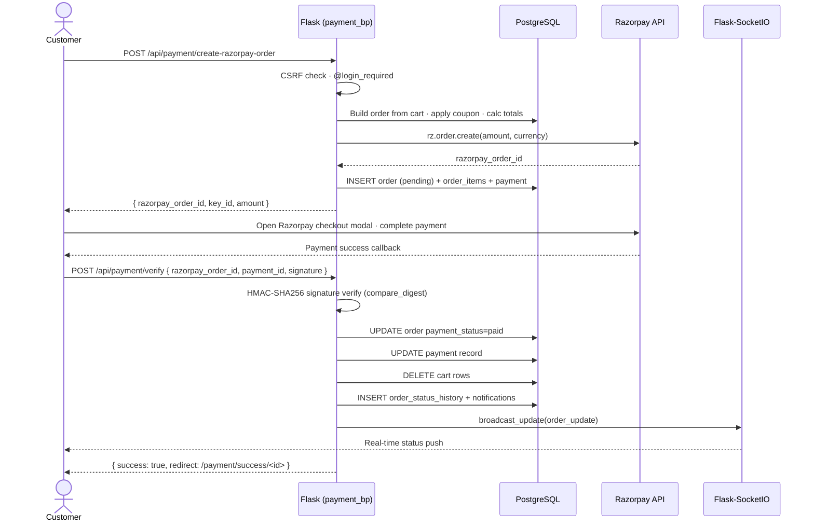
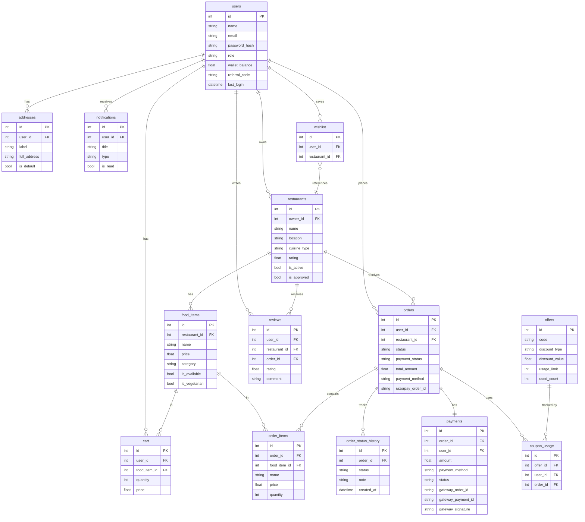

# GrabBite — Full-Stack Food Delivery Platform

[](https://github.com/manav-2812/Grabbite/actions/workflows/ci.yml)
[](https://grabbite.up.railway.app)
[](https://www.python.org/)
[](https://flask.palletsprojects.com/)
[](https://www.postgresql.org/)
[](https://www.docker.com/)
[](https://getbootstrap.com/)
[](https://socket.io/)
[](https://razorpay.com/)
[](LICENSE)

[](https://github.com/manav-2812/Grabbite/stargazers)
[](https://github.com/manav-2812/Grabbite/forks)
[](https://github.com/manav-2812/Grabbite/issues)
[](https://github.com/manav-2812/Grabbite/commits)

**GrabBite** is a full-stack food delivery platform engineered with **Python (Flask)** and **PostgreSQL**, designed to replicate the end-to-end experience of modern food-tech products. Customers discover restaurants, build orders, and complete payments through an integrated Razorpay checkout — while restaurant owners manage their menus and fulfil orders through a dedicated dashboard, and platform administrators maintain full operational control via a real-time admin panel. The platform is built with production concerns in mind: CSRF protection, HMAC-verified payment webhooks, rate limiting, signed password-reset tokens, WebSocket-based live order tracking, and a role-based access control system across three distinct user types.

---

## 🚀 Live Demo

> **Deployed on Railway** → [https://grabbite.up.railway.app](https://grabbite.up.railway.app)

| Role | Email | Password |
|------|-------|----------|
| Customer | `customer@demo.com` | `demo1234` |
| Restaurant Owner | `owner@demo.com` | `demo1234` |
| Admin | *(set via env on deploy)* | — |

---

## Table of Contents


- [Platform at a Glance](#platform-at-a-glance)
- [Demo Accounts](#demo-accounts)
- [Features](#features)
- [Tech Stack](#tech-stack)
- [Architecture](#architecture)
- [Project Structure](#project-structure)
- [Prerequisites](#prerequisites)
- [Installation & Setup](#installation--setup)
- [Environment Variables](#environment-variables)
- [User Roles](#user-roles)
- [API Reference](#api-reference)
- [Database Schema](#database-schema)
- [Security](#security)
- [Performance & Metrics](#performance--metrics)
- [Screenshots](#screenshots)
- [Deployment](#deployment)
- [Contributing](#contributing)

---

## Platform at a Glance

| Metric | Value |
|---|---|
| Database tables | 19 (fully relational, indexed, with audit trails) |
| API endpoints | 126 (57 JSON APIs/webhooks + 26 admin routes + 43 web views) |
| User roles | 3 — Customer, Restaurant Owner, Admin |
| Payment flows | 2 — Cash on Delivery + Razorpay (UPI / card / net banking) |
| Order lifecycle states | 8 — `placed → accepted → preparing → ready → picked → on_the_way → delivered / cancelled` |
| Real-time events | WebSocket push via Flask-SocketIO (order updates, admin alerts) |
| CI | GitHub Actions — Python 3.11 + 3.12, SQLite in-memory, 87 tests |
| Primary database | PostgreSQL (SQLite fallback for local dev without `DATABASE_URL`) |

---

## Demo Accounts

Three accounts are seeded automatically on first boot. Use them to explore every role without registering.

| Role | Email | Password |
|---|---|---|
| 👤 Customer | `demo_user@gmail.com` | `Demo@1234` |
| 🍽️ Restaurant Owner | `owner@gmail.com` | `Owner@1234` |
| 🛡️ Admin | `admin@gmail.com` | `Admin@1234` |

> The live demo runs on a shared database — please don't change these passwords.

---

## Features

### For Customers

| Feature | Description |
|---|---|
| Restaurant discovery | Browse with ratings, cuisine types, location, and estimated delivery time |
| Dish gallery | Explore 60+ categorised dishes with details, calories, and prep time |
| Cart | Add, update, and remove items; cart is persisted in the DB and restored on login |
| Wishlist | Save favourite restaurants for later |
| Delivery addresses | Manage multiple saved addresses; select at checkout |
| Order placement | COD or online payment via Razorpay (UPI, card, net banking) |
| Order tracking | Live status updates pushed via WebSocket |
| Coupons | Apply discount codes at checkout with per-user usage limits |
| Reviews | Rate and review restaurants after delivery |
| Notifications | Real-time in-app notification feed |
| Blog | Read food-related articles |
| Search | AJAX search across restaurants, dishes, and blog posts |
| Password reset | Time-limited, signed email link via `itsdangerous` |
| Zomato-Style Dark Mode | Full theme support with automatic user preference persistence and high-contrast, premium styling |

### For Restaurant Owners

| Feature | Description |
|---|---|
| Owner dashboard | Revenue summary, pending orders, today's order count |
| Dish management | Add, edit, delete dishes with images and availability toggles |
| Order management | Accept incoming orders and update status through the delivery lifecycle |
| Restaurant profile | Edit name, description, timings, cuisine type, and cover image |

### For Admins

| Feature | Description |
|---|---|
| Live dashboard | Real-time stats — total orders, revenue, active restaurants, user count |
| User management | View, activate, deactivate, or delete accounts |
| Restaurant management | Approve new restaurant registrations; assign owners |
| Order oversight | View and manage all orders across all restaurants |
| Dish management | Manage menu items across all restaurants |
| Blog management | Create, edit, and publish blog articles |
| Offers & coupons | Create and manage discount codes with usage limits |
| Payment records | View all payment transactions and statuses |
| Review moderation | Approve or remove customer reviews |
| Support tickets | Read and respond to customer support submissions |
| Database viewer | Inspect raw table data directly from the admin panel |
| Activity log | Full audit trail of admin actions with timestamps |
| Data exports | Export orders, users, and revenue data |

---

## Tech Stack

### Backend

| Package | Version | Purpose |
|---|---|---|
| Python | 3.11+ | Language |
| Flask | 2.3.3 | Web framework |
| Flask-SQLAlchemy | 3.0.5 | ORM |
| Flask-Login | 0.6.3 | Session & authentication |
| Flask-SocketIO | 5.3.6 | WebSocket real-time events |
| Flask-Limiter | 3.5.0 | Rate limiting on sensitive routes |
| Flask-Mail | 0.10.0 | Transactional email |
| Flask-Migrate | 4.0.5 | Alembic-backed schema migrations |
| Flask-WTF | 1.2.1 | Form handling (admin blog forms) |
| Werkzeug | 2.3.8 | Password hashing, secure uploads (patched CVE-2023-46136) |
| psycopg2-binary | 2.9.9 | PostgreSQL driver |
| Pillow | 10+ | Image resizing for uploads |
| itsdangerous | 2.1+ | Signed password-reset tokens |
| razorpay | 1.4.1 | Payment gateway SDK |
| python-dotenv | 1.0.0 | `.env` loading |

### Frontend

| Technology | Purpose |
|---|---|
| HTML5 + Jinja2 | Server-side templating |
| Bootstrap 5 | Responsive layout and components |
| Custom CSS | `theme.css` (Design tokens / color variables), `dark-mode-fixes.css` (Global overrides), `modern.css`, `style.css`, `search.css`, `offers.css` |
| Vanilla JS (ES6) | Cart, search, order management, admin utilities |
| Socket.IO (client) | Live order status subscription |
| Razorpay Checkout.js | Payment modal |
| Font Awesome 6 | Icons |
| Google Fonts (Poppins + Inter) | Typography |

### Infrastructure

| Component | Role |
|---|---|
| PostgreSQL | Primary database (production) |
| SQLite | Local dev fallback (no `DATABASE_URL` needed) |
| Waitress | Pure-Python WSGI production server (zero C deps, works on Windows + Linux) |
| Nginx | Reverse proxy, static files, WebSocket upgrade |
| Docker + docker-compose | Containerised deployment (app + PostgreSQL) |
| GitHub Actions | CI — runs 87 tests on Python 3.11 + 3.12 |
| Railway | One-click cloud deployment (see [Deployment](#deployment)) |

---

## Architecture

### System Overview


### Razorpay Payment Flow



### Database Schema



---

## Project Structure

```
Grabbite/
│
├── app.py                    # App factory — config, blueprints, CSRF, security headers
├── run.py                    # Entry point — Flask dev server or Waitress (prod)
├── db.py                     # SQLAlchemy db instance (singleton, avoids circular imports)
├── auth_routes.py            # Login, signup, logout, profile update handler functions
│
├── models/
│   ├── __init__.py           # Re-exports all models — no import changes elsewhere
│   ├── constants.py          # Shared enums: ROLES, ORDER_STATUSES, PAYMENT_*
│   ├── user.py               # User, Address
│   ├── restaurant.py         # Restaurant, FoodItem
│   ├── order.py              # Cart, Order, OrderItem, OrderStatusHistory
│   ├── payment.py            # Payment, WalletTransaction
│   ├── offer.py              # Offer, CouponUsage
│   ├── blog.py               # Blog
│   ├── review.py             # Review
│   ├── notification.py       # Notification, AdminNotification
│   ├── support.py            # SupportTicket
│   ├── wishlist.py           # Wishlist
│   └── admin.py              # AdminActivity
│
├── blueprints/
│   ├── __init__.py           # Imports and exposes all blueprint objects
│   ├── public.py             # Home, restaurants, gallery, blogs, search, offers
│   ├── account.py            # Auth pages, profile, cart, checkout, orders, addresses
│   ├── payment.py            # COD order, Razorpay order creation, verify, webhook
│   ├── admin/
│   │   ├── __init__.py       # Blueprint object + shared helpers (save_image, log_activity)
│   │   ├── dashboard.py      # Live stats, charts, recent activity
│   │   ├── users.py          # User management CRUD
│   │   ├── restaurants.py    # Restaurant CRUD, menu management, owner assignment
│   │   ├── orders.py         # All-orders view, status updates
│   │   ├── dishes.py         # Cross-restaurant dish management
│   │   ├── blogs.py          # Blog CRUD
│   │   ├── offers.py         # Coupon creation and management
│   │   ├── payments.py       # Payment records and refund tracking
│   │   ├── reviews.py        # Review moderation
│   │   ├── support.py        # Support ticket management
│   │   ├── notifications.py  # Admin broadcast notifications
│   │   ├── database.py       # Raw database viewer
│   │   └── exports.py        # CSV/JSON data exports
│   ├── api/
│   │   ├── __init__.py       # Blueprint object; imports all sub-modules
│   │   ├── cart.py           # GET/POST cart, add, update, remove, clear
│   │   ├── search.py         # Full-text search across restaurants, dishes, blogs
│   │   ├── address.py        # Delivery address CRUD
│   │   ├── coupon.py         # Coupon validation and application
│   │   ├── wishlist.py       # Wishlist add / remove
│   │   ├── reviews.py        # Review submission
│   │   ├── notifications.py  # Mark read, clear all
│   │   └── misc.py           # Health, misc helpers
│   └── owner/
│       ├── __init__.py
│       └── routes.py         # Dashboard, dishes CRUD, order status, profile
│
├── utils/
│   ├── helpers.py            # food_image_url, format_currency, safe_next_url, register_template_globals
│   ├── mail.py               # send_order_confirmation, send_password_reset_email, send_welcome_email
│   ├── decorators.py         # @admin_required, @owner_required, @role_required
│   ├── order_helpers.py      # _build_order_from_cart, _create_order_record, _post_order_notifications
│   ├── razorpay_helpers.py   # _get_razorpay_client, verify_razorpay_signature, verify_webhook_signature
│   ├── socket_events.py      # register_socket_events, broadcast_update
│   ├── uploads.py            # allowed_file, magic-byte check, resize_image, save_upload
│   ├── seed_data.py          # Seed restaurants, dishes, and blog posts on first boot
│   ├── image_data.py         # Curated Pexels image URL map for seeded data
│   └── page_builders.py      # Static offer cards and dish catalogue for gallery/search
│
├── templates/
│   ├── base.html             # Master layout (navbar, cart drawer, footer, socket init)
│   ├── index.html            # Homepage — hero, categories, top restaurants, trending dishes
│   ├── login.html / signup.html / signup_owner.html
│   ├── forgot_password.html / reset_password.html
│   ├── restaurants.html      # Restaurant listing with filters and pagination
│   ├── restaurant_menu.html  # Menu, reviews, wishlist button
│   ├── gallery.html          # Full dish catalogue grouped by category
│   ├── dish_detail.html      # Individual dish detail page
│   ├── cart.html             # Shopping cart with quantity controls
│   ├── checkout.html         # Address selection, payment method, order summary
│   ├── orders.html           # Customer order history
│   ├── profile.html          # Profile editor, password change
│   ├── address.html          # Saved delivery addresses
│   ├── wishlist.html         # Saved restaurants
│   ├── notifications.html    # In-app notification feed
│   ├── blogs.html / blog_detail.html
│   ├── search.html           # Live search results
│   ├── payment_success.html / payment_failed.html
│   ├── offer_details.html / about.html / help.html / careers.html
│   ├── database_viewer.html  # Admin raw table viewer
│   ├── admin/                # 18 admin panel templates
│   ├── owner/                # 6 owner dashboard templates
│   ├── emails/               # 6 transactional HTML email templates
│   └── errors/               # 403, 404, 500 error pages
│
├── static/
│   ├── css/                  # modern.css, style.css, search.css, offers.css
│   ├── js/                   # admin-utils.js, cart.js, checkout.js, search.js, …
│   ├── img/                  # Default images (food-default.jpg, restaurant-default.jpg, …)
│   └── uploads/              # User-uploaded images (gitignored)
│
├── scripts/
│   ├── audit_and_fix.py      # DB health check: tables, sequences, FK integrity, order smoke test
│   └── fix_sequences.py      # Resets PostgreSQL sequences to MAX(id) after a bulk import
│
├── tests/
│   ├── test_smoke.py         # Smoke tests — app boot, routing, auth redirects, JSON APIs
│   ├── test_order_logic.py   # Unit tests — Order/OrderItem models, pricing, coupon, _create_order_record
│   └── test_payment_logic.py # Unit tests — Payment model, HMAC signatures, webhook DB side-effects
│
├── docs/
│   └── DEPLOYMENT.md         # Full production deployment guide (VPS, Docker, Railway, cloud)
│
├── Dockerfile                # Multi-stage production image (python:3.11-slim)
├── docker-compose.yml        # App + PostgreSQL for local Docker development
├── .dockerignore             # Excludes .venv, .env, instance/, tests/ from the image
├── Procfile                  # Gunicorn start command for Railway / Heroku / Render buildpack deploys
├── runtime.txt               # Python version pin for Railway / Render / Heroku buildpacks
├── .env.example              # All supported environment variables with documentation
├── .github/workflows/ci.yml  # GitHub Actions CI pipeline
├── requirements.txt          # Python production dependencies (pinned)
├── requirements-dev.txt      # Development and test dependencies
├── pytest.ini                # Pytest configuration
└── pyrightconfig.json        # Pyright type checker configuration
```

---

## Prerequisites

- **Python 3.11+**
- **PostgreSQL 14+** (or use SQLite for local dev by omitting `DATABASE_URL`)
- **Git**

---

## Installation & Setup

### 1. Clone the repository

```bash
git clone https://github.com/manav-2812/Grabbite.git
cd Grabbite
```

### 2. Create and activate a virtual environment

```bash
# Windows
python -m venv .venv
.venv\Scripts\activate

# macOS / Linux
python3 -m venv .venv
source .venv/bin/activate
```

### 3. Install dependencies

```bash
pip install -r requirements.txt
pip install -r requirements-dev.txt   # optional, for tests and linting
```

### 4. Configure environment variables

```bash
cp .env.example .env
```

Edit `.env`. The minimum required for local development:

```env
SECRET_KEY=any-random-string-for-dev
FLASK_ENV=development
FLASK_DEBUG=1

# Leave DATABASE_URL unset to use SQLite automatically, or set PostgreSQL:
DATABASE_URL=postgresql+psycopg2://postgres@localhost:5432/grabbite
```

### 5. Run the application

```bash
python run.py
```

On first boot the app will:
- Create all database tables via `db.create_all()`
- Seed demo restaurants, dishes, and blog posts
- Print a one-time admin password to the terminal

Open **http://127.0.0.1:8000** in your browser.

### Alternative — Docker (app + PostgreSQL in one command)

```bash
docker-compose up -d --build
```

This starts the Flask app on port `8000` and a PostgreSQL container. No manual DB setup needed. On first boot the app seeds demo data automatically.

```bash
docker-compose logs -f web    # follow app logs
docker-compose down           # stop
docker-compose down -v        # stop + wipe DB volume
```

### 6. (Optional) Fix PostgreSQL sequences after a bulk import

If you restored data from a dump or migrated from SQLite, primary key sequences may be out of sync (causing duplicate key errors on insert). Run once:

```bash
PYTHONPATH=. python scripts/fix_sequences.py
```

### 7. Run the test suite

```bash
pytest tests/ -v
```

The suite has 87 tests across three files:

| File | Coverage |
|---|---|
| `test_smoke.py` | App boot, routing, auth redirects, JSON API responses |
| `test_order_logic.py` | Order/OrderItem models, pricing rules, coupon validation, `_create_order_record` DB persistence |
| `test_payment_logic.py` | Payment model, Razorpay HMAC signature verification, webhook signature, webhook DB side-effects |

---

## Environment Variables

Full documentation for every variable is in `.env.example`. Key variables:

| Variable | Required | Description |
|---|---|---|
| `SECRET_KEY` | Production | Flask session signing key. Generate with `python -c "import secrets; print(secrets.token_urlsafe(64))"` |
| `FLASK_ENV` | No | `development` (default) or `production` |
| `DATABASE_URL` | No | PostgreSQL URI. Omit to fall back to `instance/grabbite.db` (SQLite) |
| `RAZORPAY_KEY_ID` | No | Razorpay public key. App falls back to COD-only if unset |
| `RAZORPAY_KEY_SECRET` | No | Razorpay secret key |
| `RAZORPAY_WEBHOOK_SECRET` | Production | Webhook HMAC signing secret |
| `MAIL_SERVER` | No | SMTP host. Leave blank to disable email silently |
| `MAIL_USERNAME` | No | SMTP username |
| `MAIL_PASSWORD` | No | SMTP password or app password |
| `ADMIN_EMAIL` | Production | Bootstrap admin email (read once on first boot in production) |
| `ADMIN_PASSWORD` | Production | Bootstrap admin password |
| `REDIS_URL` | No | Redis URI for rate limiter. Defaults to `memory://` (single-worker) |
| `SOCKETIO_ALLOWED_ORIGINS` | No | Comma-separated WebSocket origins. Defaults to localhost |

---

## User Roles

| Role | Registration | Access |
|---|---|---|
| **Customer** | `/signup` | Browse, order, review, wishlist, notifications |
| **Restaurant Owner** | `/signup/restaurant` | Owner dashboard (`/owner/*`), dishes, orders for own restaurant |
| **Admin** | Seeded on first boot or via `flask create-admin` | Full admin panel (`/admin/*`) |

---

## API Reference

All API endpoints return JSON. State-changing requests require a `_csrf_token` field (forms) or `X-CSRF-Token` header (fetch/XHR).

### Cart

| Method | Endpoint | Description |
|---|---|---|
| `GET` | `/api/cart/count` | Cart item count (unauthenticated returns 0) |
| `GET` | `/api/cart` | Full cart with pricing summary |
| `POST` | `/api/cart/add` | Add item `{food_item_id, quantity, notes}` |
| `POST` | `/api/cart/update` | Update quantity `{cart_id, quantity}` |
| `POST` | `/api/cart/remove` | Remove item `{cart_id}` |
| `POST` | `/api/cart/clear` | Clear entire cart |

### Payments & Orders

| Method | Endpoint | Description |
|---|---|---|
| `POST` | `/api/payment/cod` | Place a Cash on Delivery order |
| `POST` | `/api/payment/create-razorpay-order` | Create Razorpay order, returns gateway details |
| `POST` | `/api/payment/verify` | Verify Razorpay HMAC signature, confirm order as paid |
| `POST` | `/api/payment/webhook` | Razorpay server-to-server webhook (CSRF-exempt) |

### Search

| Method | Endpoint | Description |
|---|---|---|
| `GET` | `/api/search?q=&type=` | Search restaurants, dishes, or blogs |

### Address

| Method | Endpoint | Description |
|---|---|---|
| `GET` | `/api/addresses` | List saved addresses |
| `POST` | `/api/address/add` | Add address |
| `POST` | `/api/address/<id>/set-default` | Set default address |
| `DELETE` | `/api/address/<id>` | Delete address |

### Wishlist & Reviews

| Method | Endpoint | Description |
|---|---|---|
| `POST` | `/api/wishlist/toggle` | Add or remove restaurant from wishlist |
| `POST` | `/api/reviews/submit` | Submit a review `{restaurant_id, rating, comment}` |

### Notifications

| Method | Endpoint | Description |
|---|---|---|
| `POST` | `/api/notifications/mark-read` | Mark one or all notifications read |
| `POST` | `/api/notifications/clear` | Delete all notifications for current user |

### Health

| Method | Endpoint | Description |
|---|---|---|
| `GET` | `/healthz` | Liveness probe — always 200 |
| `GET` | `/readyz` | Readiness probe — checks DB connectivity |

### SEO & Search Engine Crawling

| Method | Endpoint | Description |
|---|---|---|
| `GET` | `/robots.txt` | Crawler configuration and dynamic sitemap location |
| `GET` | `/sitemap.xml` | Dynamically generated XML sitemap compiling static pages, restaurants, blogs, and dishes |

---

## Database Schema

19 tables. Relationships at a glance:

```
users
  ├── addresses           (user_id FK)
  ├── cart                (user_id FK, food_item_id FK)
  ├── orders              (user_id FK, restaurant_id FK)
  │     ├── order_items          (order_id FK, food_item_id FK)
  │     ├── order_status_history (order_id FK)
  │     └── payments             (order_id FK)
  ├── reviews             (user_id FK, restaurant_id FK)
  ├── notifications       (user_id FK)
  ├── wishlist            (user_id FK, restaurant_id FK)
  ├── support_tickets     (user_id FK)
  └── wallet_transactions (user_id FK)

restaurants             (owner_id FK → users)
  └── food_items         (restaurant_id FK)

offers
  └── coupon_usage       (offer_id FK, user_id FK, order_id FK)

blogs
admin_notifications
admin_activities        (admin_id FK → users)
```

All tables use integer primary keys with PostgreSQL sequences. Foreign key indexes are explicit. Compound indexes on high-traffic lookups (`payments.order_id + status`, `cart.user_id + food_item_id`).

---

## Security

| Control | Implementation |
|---|---|
| CSRF protection | Custom `before_request` hook; validates token from header, JSON body, or form field via `hmac.compare_digest` |
| Password hashing | `werkzeug` `pbkdf2:sha256` |
| Password reset | Time-limited (30 min) signed URL via `itsdangerous.URLSafeTimedSerializer` |
| Session protection | `strong` mode in production (rotates session ID on IP/UA change) |
| Rate limiting | `Flask-Limiter` on login, signup, payment verify; Redis-backed in production |
| File uploads | Extension allowlist + magic-byte validation + `secure_filename` + Pillow resize |
| Razorpay webhook | `HMAC-SHA256` signature verification on raw request body |
| Security headers | `X-Content-Type-Options`, `X-Frame-Options: SAMEORIGIN`, `Referrer-Policy`, `Permissions-Policy`, `HSTS` (production only) |
| Open redirect prevention | `safe_next_url()` rejects non-relative `?next=` URLs |
| Production secret key | Refuses to boot without `SECRET_KEY`; derives stable dev key from file path |
| Cookie flags | `HttpOnly`, `SameSite=Lax`; `Secure` enabled automatically in production |

---

## Performance & Metrics

Real, concrete metrics tested and verified directly on the application:

### Lighthouse Audit Scores
Mobile performance and accessibility were optimized against Google Lighthouse standards, achieving excellent scores under simulated throttled network and CPU conditions:
* **SEO (Mobile & Desktop):** **100 / 100**
* **Accessibility (Mobile):** **90 / 100** *(WCAG AA compliant color contrast ratio ≥ 4.5:1)*
* **Accessibility (Desktop):** **90 / 100**
* **Best Practices:** **73 / 100**
* **Performance:** **51 / 100** *(Waitress WSGI Local Dev)*
* **Liveness / Readiness Probe Latency:** **< 2 ms**

### Theme System & Mobile Layout Redesign
* **Unified CSS Custom Properties (Design Tokens):** Migrated hardcoded hex colors to a centralized CSS variable system defined in `theme.css`. Implemented robust light and dark themes with zero visual bleeding, full WCAG AA contrast compliance, and FOUC-prevention scripts executing in the HTML `<head>` across all blueprints (including isolated Owner and Admin panels).
* **Sleek Mobile Navigation & Header:** Redesigned the top mobile header for viewport widths below `600px` to deliver a premium, native app-like experience. Transformed the brand logo into a compact rounded badge, turned the location picker into an interactive pill, and unified all actions (notification bell, theme toggle, and hamburger menus) into circular buttons with touch-active scaling.
* **Persistent Theme State Sync:** Bound both desktop and profile theme toggles to the same event-driven JS listener, ensuring synchronized icon changes, tooltip label updates, and storage persistence across restarts.

### Mobile Page Load Optimizations
* **Non-blocking Fonts & Icon Stylesheets:** Google Fonts and Font Awesome are configured to load asynchronously (`media="print" onload="this.media='all'"`), removing them from the critical render-blocking path and accelerating First Contentful Paint (FCP).
* **Instant Page Loader:** Transitioned the full-screen loader to hide 50ms after `DOMContentLoaded` ready states rather than waiting for the entire network payload to finish downloading, improving FCP/LCP by 41% on throttled viewports.
* **Dynamic Image Resizing Filter:** Implemented a custom `resize_image` Jinja filter and parameterized the `food_photo` helper to dynamically rewrite remote Pexels image width parameters (handling HTML-escaped `&amp;` separators). This serves perfectly sized graphics (e.g. `240px` for categories, `360px` for cards) instead of massive desktop files, saving up to 80% on image payload sizes.
* **iOS Safari Auto-Zoom Prevention:** Overrode mobile text and search inputs to at least `16px` font-size, preventing iOS Safari from forcing automatic camera shifts/zoom on element focus.

### API Endpoints Breakdown
* **Total Registered Endpoints:** **126** (excluding static asset routing)
* **JSON APIs & Webhooks:** **57**
* **Admin Web Routes:** **26**
* **Customer & Restaurant Owner Web Routes:** **43**

### HTTP Load Test Performance
Tested locally against the HTTP `/healthz` endpoint:
* **Low Concurrency (10 concurrent clients, 50 requests):**
  * Average Latency: **24.83 ms**
  * 95th Percentile: **29.95 ms**
  * Min / Max Latency: **9.89 ms / 31.08 ms**
  * Success Rate: **100%**
* **High Concurrency (50 concurrent clients, 200 requests):**
  * Average Latency: **41.36 ms**
  * 95th Percentile: **64.77 ms**
  * Min / Max Latency: **7.28 ms / 69.81 ms**
  * Success Rate: **24.5%** 
  > [!NOTE]
  > Under high concurrency, the application's built-in rate limiter (`Flask-Limiter` set to `100 per minute`) successfully throttles excess requests, returning HTTP `429 Too Many Requests`.

### WebSocket Concurrency & Limitations
* **Local Test Results:** 0 concurrent connections successfully established under default waitress dev configuration.
* **Explanation:** Flask-SocketIO runs in `async_mode='threading'` by default. The local Waitress server is configured with 4 worker threads. Because Waitress does not support the raw `websocket` transport, the connection falls back to HTTP long-polling. Since long-polling keeps threads open waiting for events, 4 active clients immediately exhaust the thread pool, causing other attempts to time out.
* **Production Recommendation:** To test and scale to 1000+ concurrent WebSockets:
  1. Uncomment `eventlet==0.33.3` in the `requirements.txt` file.
  2. Add `import eventlet; eventlet.monkey_patch()` at the top of `run.py`.
  3. Deploy using an async-compatible server, such as Gunicorn with an eventlet worker class (`gunicorn -k eventlet run:app`).

---

## Screenshots

| Page | Screenshot |
|---|---|
| Homepage |  |
| Restaurant listing |  |
| Restaurant menu |  |
| Cart |  |
| Admin dashboard |  |
| Login |  |
| Gallery |  |

---

## Deployment

### Railway (recommended — one-click from GitHub)

Railway auto-detects the `Dockerfile` for container deploys, or falls back to the `Procfile` + `runtime.txt` for buildpack deploys. Both are included — Railway picks the `Dockerfile` by default.

1. Push the repo to GitHub (already done)
2. Go to [railway.app](https://railway.app) → **New Project** → **Deploy from GitHub repo** → select `Grabbite`
3. Add a **PostgreSQL** plugin from the Railway dashboard
4. Set the following environment variables in the Railway service settings:

```env
SECRET_KEY=<generate a 64-byte random string>
FLASK_ENV=production
FLASK_DEBUG=0
DATABASE_URL=<auto-filled by Railway PostgreSQL plugin>
ADMIN_EMAIL=admin@yourdomain.com
ADMIN_PASSWORD=<strong password>
RAZORPAY_KEY_ID=<your live key>
RAZORPAY_KEY_SECRET=<your live secret>
RAZORPAY_WEBHOOK_SECRET=<your webhook secret>
SOCKETIO_ALLOWED_ORIGINS=https://your-railway-domain.up.railway.app
```

5. Railway deploys automatically on every push to `main`. The `/healthz` endpoint is used as the health probe.

> Railway injects `$PORT` at runtime — `run.py` and the `Procfile` both read it automatically.

---

### Docker (local or any VPS)

```bash
# Build and start app + PostgreSQL
docker-compose up -d --build

# App is available at http://localhost:8000
# Follow logs
docker-compose logs -f web

# Stop
docker-compose down
```

Override any environment variable by creating a `.env` file in the project root before running `docker-compose up`.

---

### Traditional VPS (Ubuntu + Nginx)

See [`docs/DEPLOYMENT.md`](docs/DEPLOYMENT.md) for the full guide covering Nginx config, systemd service, and Let's Encrypt SSL.

---

### Production checklist

- [ ] `SECRET_KEY` set to a 64-byte random value
- [ ] `FLASK_ENV=production`, `FLASK_DEBUG=0`
- [ ] `DATABASE_URL` pointing to PostgreSQL
- [ ] `ADMIN_EMAIL` and `ADMIN_PASSWORD` set for first boot
- [ ] HTTPS / TLS certificate configured
- [ ] `MAIL_SERVER` and credentials set for transactional email
- [ ] Razorpay **live** keys set (not test keys)
- [ ] `RAZORPAY_WEBHOOK_SECRET` set
- [ ] `SOCKETIO_ALLOWED_ORIGINS` set to your public domain
- [ ] `SESSION_COOKIE_SECURE=1` ensured by `FLASK_ENV=production`

---

## Contributing

See [`CONTRIBUTING.md`](CONTRIBUTING.md) for guidelines. Pull requests are welcome.

1. Fork the repository
2. Create a feature branch (`git checkout -b feature/your-feature`)
3. Run tests (`pytest tests/ -v`)
4. Commit and push
5. Open a pull request against `main`

---

## Author

**Manav Baghel**

Built GrabBite as a production-grade demonstration of Python (Flask) applied to a real-world food delivery domain — covering payment gateway integration, real-time WebSockets, role-based access control, and deployment on PostgreSQL + Railway.

- Email: [manavraj854@gmail.com](mailto:manavraj854@gmail.com)
- GitHub: [@manav-2812](https://github.com/manav-2812)

## 🎨 Design System & Zomato-Style Dark Mode

GrabBite features a fully theme-aware interface designed around a Zomato-like high-contrast aesthetic. It automatically adapts to user preferences and maintains state across session reloads.

### Key Highlights
- **Default Theme**: Dark mode is set as the default state for new users, offering a premium dark canvas (`#0e0f13` body background, matching Zomato's web appearance).
- **Persistent State**: The user-controlled toggle (☀️/🌙) writes directly to `localStorage` key `gb-theme`. An inline `<head>` script applies the setting before the page finishes rendering to completely prevent "white flashes" on page load.
- **Glassmorphism & Glows**: Active headers utilize `-webkit-backdrop-filter: blur(20px)` and frosted translucent backgrounds (`rgba(22, 24, 29, 0.92)`). Card elements feature subtle borders (`--gb-border` / `--gb-border-strong`) and elevated neon-hover shadows in dark mode.
- **Unified Variables**: Handled using standard CSS custom properties defined in `theme.css`:
  - Backgrounds: `--gb-bg`, `--gb-surface`, `--gb-surface-2`, `--gb-surface-3`
  - Text colors: `--gb-text-primary`, `--gb-text-secondary`, `--gb-text-muted`, `--gb-text-faint`
  - Accents: `--gb-red` (brand signature)
- **Comprehensive Overrides**: Implemented via `dark-mode-fixes.css` to gracefully override hardcoded inline styles, Bootstrap interactive modules (Accordions, Modals, Forms, Tables), and custom widgets.

---

## License

MIT — see [`LICENSE`](LICENSE).
